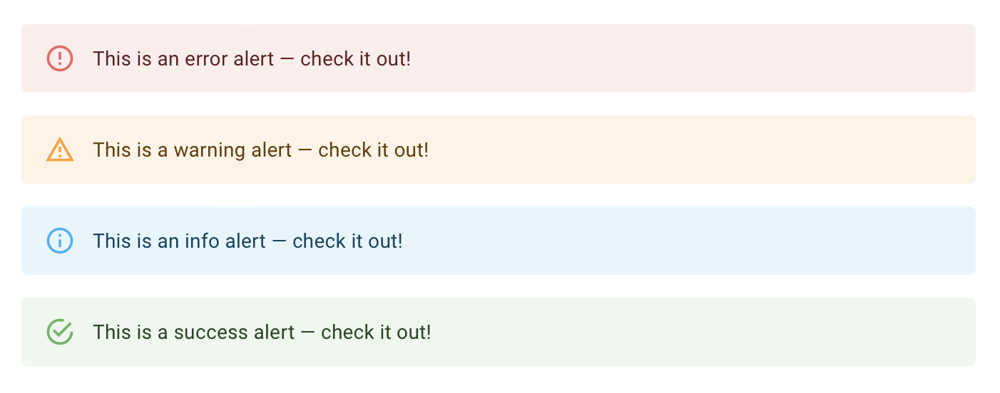
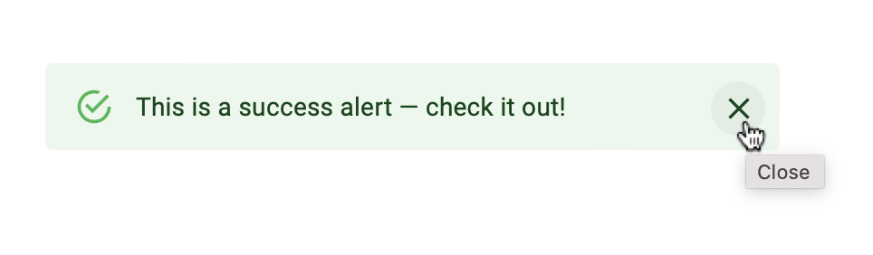

# Pure Components in React



```jsx
<Alert severity="error">This is an error alert — check it out!</Alert>
<Alert severity="warning">This is a warning alert — check it out!</Alert>
<Alert severity="info">This is an info alert — check it out!</Alert>
<Alert severity="success">This is a success alert — check it out!</Alert>
```

`<Alert/>` componenti hazırlayın. `severity` propsu alertin rəngini və icon'unu təyin edəcək.
Əgər bu props verilməyibsə default `success` olacaq.


## Callbacks



```jsx
<Alert onClose={() => {}}>This is a success alert — check it out!</Alert>
```

Əgər `onClose` propsu verilibsə Alertin sağında `X` buttonu olsun və ona click etdikdə `props.onClose()` callbackı çağırılsın.
