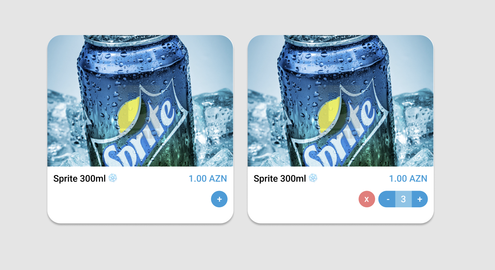

# Pure Components (Part 2)



Pure componentlər öz daxilində state tutmayaraq baş verən hadisələri
parentinə ötürən componentlərdir.
Bu tipli componentlər əsasən öz daxilində dizayn/css kodlarını saxlayır. Özündə baş verən hadisələri (event handlers, onClick və.s.) isə handle etməsi üçün parentə ötürür.

İlk taskımız olaraq, yuxarı şəkildə göstərilmiş Cart Item dizaynı üçün React Pure Component hazırlayacağıq.

```jsx
<CartItem
  title="Sprite 300ml"
  price="1.00 AZN"
  thumbnail={url}
  quantity={3}
  onChange={myCallback}
/>
```

`<CartItem/>` teqimiz yuxarıdakı signature'a sahib olmalıdır.

`title`, `price` və `thumbnail` Cart Item'in adı, qiyməti və fotosunun URL'si olacaq.

`quantity` bu məhsulun səbəttə neçə ədəd olduğunu bildirir. Əgər `quantity` prop'u `1`-dən kiçikdirsə, fotoda solda göstərildiyi kimi
sadəcə `+ (plus)` buttonu görünməlidir. `1`-dən böyük olduğu hallarda isə,
sağ tərəfdəki kimi, `x (remove)`, `- (minus)`, `- (plus)` buttonları
və cari quantity göstərilməlidir.

`onChange` isə `x, -, +` buttonlarına click etdikdə çağırılacaq callback funksiyadır. `x` buttonun clicklədikdə `onChange(0)` çağırılmalıdır. `-` zamanı `onChange(quantity - 1)`, `+` zamanı isə `onChange(quantity + 1)`

## Restrictions

Styling üçün `emotion` istifadə edin, inline css yazmayın. Repo-da sizin
istifadəniz üçün hazır emotion quraşdırılıb. Nümunələrə baxın.

`<CartItem/>` componenti daxilində `React.useState()` və digər
state management tipli hooklar istifadə etməyin.
Eventları `props.onChange()` callbackına göndərin.
