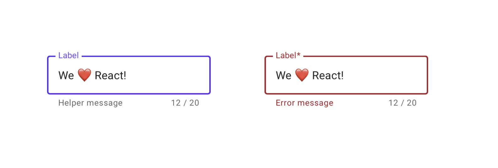

# Pure Components (Part 3)



```jsx
<TextField
  label="Label"
  value="We ❤️ React!"
  onChange={(e) => {}}
  isRequired={false}
  maxLength={20}
  helperText="Error message"
  error={true}
/>
```

## Props

| Name       | Type     | Default |
|------------|----------|---------|
| label      | string   | null    |
| value      | string   | null    |
| onChange   | callback | null    |
| isRequired | bool     | false   |
| maxLength  | int      | null    |
| helperText | string   | null    |
| error      | bool     | false   |

React-da input fieldlar da pure component sayılır. Userin inputunu öz daxili state'ndə saxlamaq əvəzinə parentə callback ilə ötürürlər.
Məsələn yuxarıda verilmiş `<TextField/>` componentinə sadəcə `value` propsu ötürülsə (`onChange` olmadan), həmin field read-only olacaq, user texti editləyə bilməyəcək.

Verilmiş propsları olan `<TextField/>` componenti hazırlayın. `isRequired` propsu `true` verildikdə labelin sağında `asterisk (*)` göstərin.
`maxLength` verilibsə, inputun altında indiki cari length və maxLength olacaq. `helperText` isə null deyilsə inputun altında görünəcək.

`error` propsu `true` olduqda border, label və helper text qırmızı rəngdə olacaq.

Son olaraq userin daxil etməyə çalışdığı input `maxLength`-dən böyük olduqda `onChange` callbackını çağırmayın.

## Restrictions

`<TextField/>` componenti daxilində `React.useState()` istifadə etməyin.
