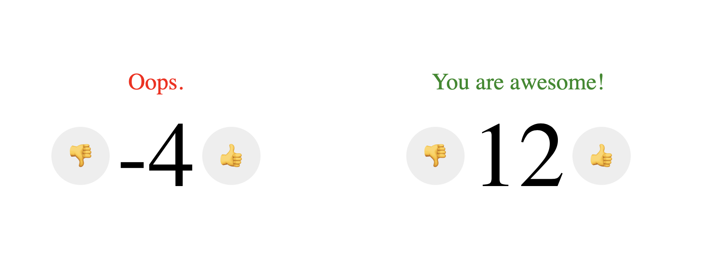

# useState()



```jsx
<HappyCounter/>
```

`<HappyCounter/>` stateful componenti hazırlayın. Bu componentin heç bir propsu olmayacaq.

Like və dislike etmək üçün 2 button yerləşdirin, like/dislike etdikdə counteri 1 vahid artırıb/azaldın.

Əgər likeların sayı 5-dən böyükdürsə yuxarıda yaşıl rənglərlə təbrik mətni yazın. Mənfi olduqda isə qırmızı rənglərlə `Oops.`.

## Bonus
Counter'i sıfırlamaq üçün reset düyməsi yerləşdirin aşağı hissəyə.

## Restrictions
`React.useState()` hookundan istifadə edin. Reactın köhnə class tipli componentləri üçün olan `setState()` ilə etməyin..

- https://reactjs.org/docs/hooks-reference.html#usestate
