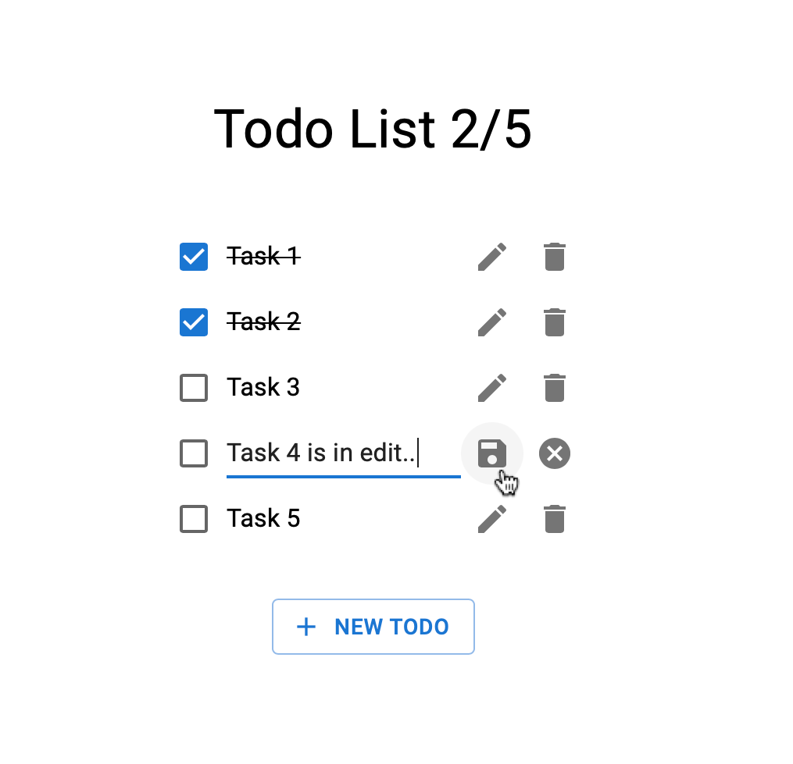

# useState() (Part 2)



```jsx
<TodoList/>
```

`<TodoList/>` stateful componenti hazırlayın. İlkin halda todo olmayacaq,
`+ NEW TODO` buttonuna clicklədikdə yeni todo əlavə edəcək. Todo-nun textini dəyişmək üçün edit iconuna clickləmək lazımdır.
Bu zaman adi text, input ilə əvəz olunacaq, editləyib save etdikdə todo update olmalıdır, əgər cancel iconuna clickləsə
todo-nun əvvəlki value-si geri gəlməlidir və edit halından çıxmalıdır item.

Yuxarıda completed və total todoların sayı göstərilməlidir.

## Bonus
`Export as JSON` buttonu əlavə edin, ona clicklədikdə TodoList datalarını json stringə çevirib ekrana yazın. 

## Restrictions
`React.useState()` hookundan istifadə edin. Reactın köhnə class tipli componentləri üçün olan `setState()` ilə etməyin..
