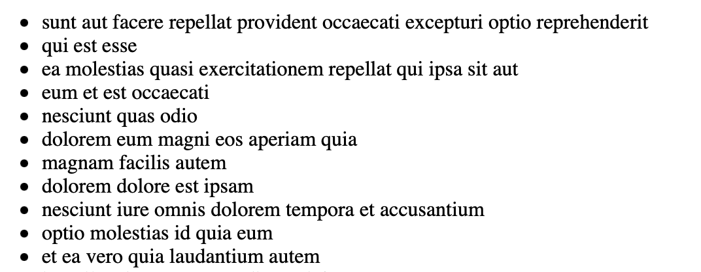

# useEffect()



```jsx
<Posts/>
```

### Part 1

`<Posts/>` stateful componenti hazırlayın. Bu component öz daxilində `posts` 
adlı array tipində state tutacaq və o arrayı `<ul>` içində `<li>` olaraq render etməlidir.

`Fetch` düyməsi əlavə edin, bu düyməyə clicklədikdə ilk öncə `posts` state-ni `null` edin sonra `https://jsonplaceholder.typicode.com/posts` linkinə ajax ataraq
postları çəkib `posts` state-nə doldurun. `posts` null olduğu halda isə componentiniz `Loading...` render etməlidir.

### Part 2

Postları səhifə açıldıqda `Fetch` düyməsinə click etmədən birbaşa ajax ataraq çəkərsək user experience baxımından daha yaxşı olar.
Fetch buttonunu olduğu kimi saxlayın, ona click edildikdə işə düşən callbackı `<Posts/>` componenti daxilində birbaşa call edin.

Daha sonra browserdə network tabına keçərək nələr baş verdiyini qeyd edin. Əgər sonsuz sayda arası kəsilmədən ajax sorğu atırsa düzgün etməmişik deməkdir.

Bu problemin səbəbini və onu `useEffect()` ilə necə həll edə biləyinizi araşdırıb həll edin.

### Restrictions
`async/await` syntaxı və `fetch()` API istifadə edərək http sorğularınızı atın.
