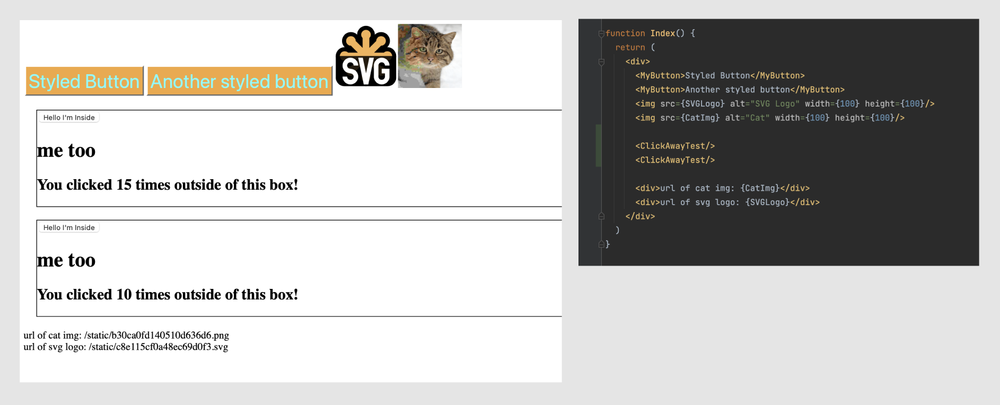

# Click away!

Özündən kənara edilən clickləri tuta bilən component hazırlayın.
Misal olaraq dropdown, select kimi inputlar özündən kənara click edildikdə close olurlar.

Event listenerları leak etməməyə diqqət edin. Hansısa dom elementə event listener əlavə etdiyiniz kimi
zamanı gəldiyində remove etməyi də unutmayın.

